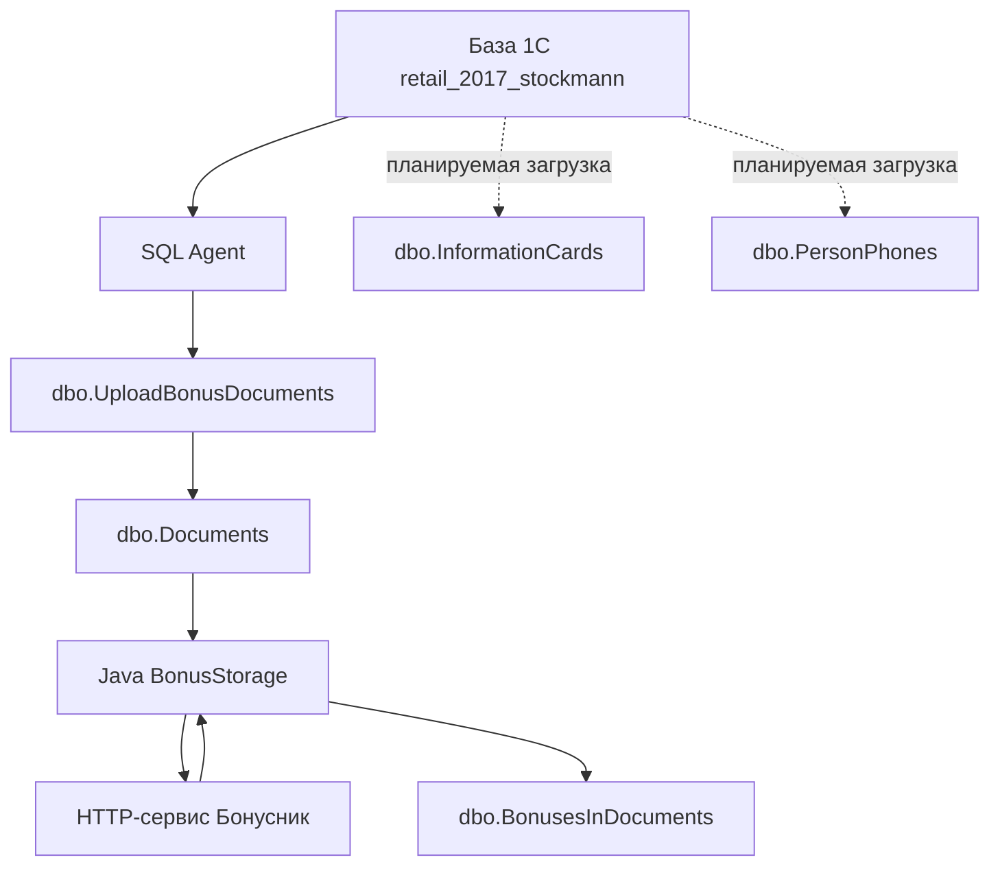

# BonusStorage

`BonusStorage` — внутреннее Java-приложение для хранения истории бонусных операций по документам розничной системы.

Проект объединяет три части:

1. SQL Server загружает изменившиеся документы напрямую из базы 1С.
2. Java-приложение запрашивает по этим документам бонусные события во внешнем HTTP-сервисе.
3. Полученные бонусные события сохраняются в локальной базе `BonusStorage`.

Дополнительно в проекте начата подготовка витрины информационных карт и телефонов физических лиц.

## Общая схема



## Загрузка документов из 1С

SQL Server Agent запускает задание `UploadBonusDocumentsRegl`. Задание выполняет хранимую процедуру:

```sql
EXEC dbo.UploadBonusDocuments;
```

Процедура:

1. Находит источник `retail_2017_stockmann` в таблице `SourceBases`.
2. Получает перечень типов документов из `DocumentTypes`.
3. Для каждого типа определяет максимальную уже загруженную `CurrentVersion`.
4. Через динамический SQL читает физическую таблицу документа в базе 1С.
5. Добавляет новые документы в `Documents`.
6. Обновляет ранее загруженные документы, если изменилась их версия.
7. Устанавливает `IsChanged = 1`, чтобы Java-приложение обработало документ.

Физические таблицы 1С и их логические типы задаются данными в `DocumentTypes`.

Скрипт процедуры: [sql/procedures/upload_bonus_documents.sql](sql/procedures/upload_bonus_documents.sql).

## Обработка бонусных событий

Точка входа приложения — `BonusStorageApplication`.

После запуска Spring Boot создаёт `BonusStorageApplicationRunner`, который выполняет основной процесс:

1. Выбирает ограниченное количество документов с `IsChanged = 1`.
2. Формирует пакет с идентификатором сессии и идентификаторами документов.
3. Устанавливает для выбранных документов:
   - `IsChanged = 0`;
   - `BonusesUploaded` — текущее время.
4. Отправляет пакет HTTP POST-запросом в сервис «Бонусник».
5. Разбирает полученный JSON.
6. Для каждого документа удаляет прежние строки из `BonusesInDocuments`.
7. Сохраняет актуальные бонусные события.

Количество документов в одном пакете задаётся свойством:

```properties
uploadingbonuses.documentsCount
```

### Формат исходящего пакета

```json
{
  "session": "uuid",
  "documents": [
    {
      "document_guid": "uuid",
      "document_type": "1"
    }
  ]
}
```

### Формат ответа

Ответ отображается на DTO:

- `ResultInput` — сессия и документы;
- `DocumentInput` — реквизиты документа и список событий;
- `BonusesInput` — бонусная операция;
- `BonusDateInput` — период действия бонусов.

## Структура Java-кода

```text
src/main/java/ru/stockmann/BonusStorage
├── BonusStorageApplication.java
├── BonusStorageApplicationRunner.java
├── models
│   ├── API
│   │   ├── BonusDateInput.java
│   │   ├── BonusesInput.java
│   │   ├── DocumentInput.java
│   │   └── ResultInput.java
│   ├── BonusesInDocument.java
│   └── Document.java
├── repositories
│   ├── BonusesInDocumentRepository.java
│   └── DocumentRepository.java
├── services
│   ├── BonusesInDocumentService.java
│   └── DocumentService.java
└── utils
    ├── Converting.java
    └── IdConverter.java
```

### Слои приложения

- **models** — JPA-сущности локальной базы.
- **models/API** — DTO входящего JSON от сервиса «Бонусник».
- **repositories** — Spring Data JPA-репозитории.
- **services** — операции чтения, сохранения и удаления.
- **BonusStorageApplicationRunner** — оркестрация полного процесса.
- **utils** — преобразование UUID и бинарных идентификаторов 1С.

## Модель данных

### SourceBases

Настройки доступных баз-источников:

- имя источника;
- SQL-префикс подключения;
- техническая версия обработки бонусов.

### DocumentTypes

Соответствие логического типа документа физической таблице 1С.

### Documents

Локальная витрина документов:

- источник и тип документа;
- бинарный идентификатор 1С;
- UUID в строковом представлении;
- дата и номер документа;
- версия 1С;
- признак необходимости обработки;
- даты создания, изменения и загрузки бонусов.

### BonusesInDocuments

Бонусные события документа:

- магазин;
- номер карты;
- вид начисления;
- значение;
- тип и текст операции;
- заказ;
- период действия бонусов.

Каждая строка связана с `Documents` внешним ключом.

### OperationTypes

Справочник названий типов бонусных операций.

### SMS_informed

Информация об отправленных уведомлениях по документу:

- документ;
- версия;
- количество событий;
- время уведомления.

### InformationCards и PersonPhones

Таблицы новой витрины:

- `InformationCards` хранит информационные карты, связь с физлицом и версию 1С;
- `PersonPhones` хранит телефоны физических лиц и версию 1С.

Поиск планируется:

- по номеру карты через индекс `IX_InformationCards_CardCode`;
- по телефону через индекс `IX_PersonPhones_Phone`.

DDL таблиц и процедуры их инкрементальной загрузки уже добавлены.

## SQL-скрипты

```text
sql
├── README.md
├── data
│   └── reference_data.sql
├── ddl
│   ├── documents.sql
│   └── information_cards.sql
└── procedures
    ├── upload_bonus_documents.sql
    ├── upload_information_cards.sql
    └── upload_person_phones.sql
```

Для создания новой базы скрипты выполняются в следующем порядке:

1. `sql/ddl/documents.sql`
2. `sql/ddl/information_cards.sql`
3. `sql/data/reference_data.sql`
4. скрипты из `sql/procedures`

Подробности находятся в [sql/README.md](sql/README.md).

## Конфигурация приложения

Основные параметры:

```properties
spring.datasource.url
spring.datasource.username
spring.datasource.password

uploadingbonuses.documentsCount
uploadingbonuses.urlbonusnik
uploadingbonuses.user
uploadingbonuses.password
```

Параметры подключения и учётные данные должны задаваться отдельно для каждой среды. Рабочие пароли не должны храниться в Git.

Логирование настраивается в:

```text
src/main/resources/logback-spring.xml
```

Логи выводятся в консоль и файл `logs/BonusStorage.log`.

## Сборка и запуск

Требования:

- Java 17;
- Maven Wrapper;
- Microsoft SQL Server;
- доступ к базе `BonusStorage`;
- сетевой доступ к HTTP-сервису «Бонусник».

### Windows

```powershell
.\mvnw.cmd clean package
.\mvnw.cmd spring-boot:run
```

### macOS и Linux

```bash
./mvnw clean package
./mvnw spring-boot:run
```

Собранный JAR находится в каталоге `target`.

## Тестирование

В проекте присутствует только отключённый тест загрузки Spring-контекста:

```text
src/test/java/ru/stockmann/BonusStorage/BonusStorageApplicationTests.java
```

Автоматическое тестовое покрытие бизнес-логики пока отсутствует.

## Текущее поведение и ограничения

- Проект не предоставляет REST API: зависимость `spring-boot-starter-web` отключена.
- Java-приложение предназначено для фоновой обработки данных.
- `ApplicationRunner` гарантированно выполняется при старте приложения.
- В коде присутствует `@Scheduled(fixedRate = 30000)`, однако планирование Spring отдельно не включено через `@EnableScheduling`.
- Документы помечаются обработанными до получения успешного ответа внешнего сервиса.
- HTTP-запрос не содержит явно настроенных тайм-аутов и повторных попыток.
- SQL-загрузка документов и Java-обработка являются двумя отдельными механизмами.
- Таблицы `InformationCards` и `PersonPhones` загружаются отдельными SQL-процедурами по версиям объектов 1С.
